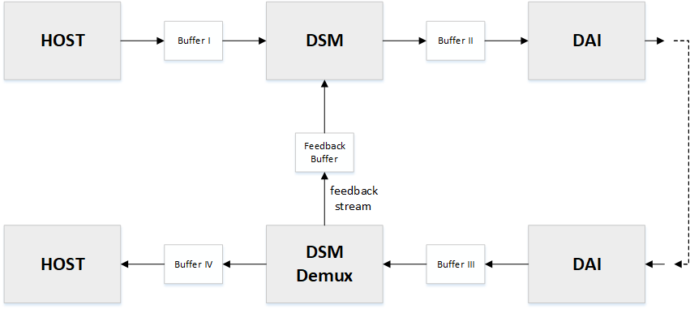

.. _apps-component-dsm:

Dynamic Speaker Management component
####################################

Sound Open Firmware architecture supports Dynamic Speaker Management (DSM)
components. Basic Dynamic Speaker Management template is available at
the following link:
https://github.com/thesofproject/sof/tree/topic/dsm-comp .
Before reading the following tutorial, it is advisable to become familiar
with :ref:`developer_guides_hello_world`.

Above template could be useful to implement fully functional DSM and
DSM Demux component. What above template does is handling basic pipeline/capture
stream and implements dummy functions for processing feedback stream.
DSM and DSM Demux functions are placed in the same file: *src/audio/dsm.c*
and they are split into two separate ``comp_driver`` structures.

.. code-block:: c

	struct comp_driver comp_dsm = {
		.type = SOF_COMP_DSM,
		.ops = {
			.new = dsm_new,
			.free = dsm_free,
			.params = dsm_params,
			.prepare = dsm_prepare,
			.trigger = dsm_trigger,
			.copy = dsm_copy,
			.reset = dsm_reset,
		},
	};

	struct comp_driver comp_dsm_demux = {
		.type = SOF_COMP_DSM_DEMUX,
		.ops = {
			.new = dsm_new,
			.free = dsm_free,
			.params = dsm_demux_params,
			.prepare = dsm_demux_prepare,
			.trigger = dsm_demux_trigger,
			.copy = dsm_demux_copy,
			.reset = dsm_reset,
		},
	};
 
Some of teamplate functions e.g. dsm_new() could be the same for DSM and 
DSM Demux component.

Basic DSM Topology
******************

Dynamic Speaker Management consists of two components: DSM component
included in the playback pipeline and DSM Demux component included in
the capture pipeline. Also, there is required,  additional buffer
between DSM and DSM Demux components for the "feedback" stream.

        

Constructor ``dsm_new()``
*************************

.. code-block:: c

	static struct comp_dev *dsm_new(struct sof_ipc_comp *comp)
	{
		struct comp_dev *dev;
		struct sof_ipc_comp_dsm *dsm;
		struct sof_ipc_comp_dsm *ipc_dsm =
			(struct sof_ipc_comp_dsm *)comp;
		struct dsm_data *dd;

		trace_dsm("dsm_new()");

		if (IPC_IS_SIZE_INVALID(ipc_dsm->config)) {
			IPC_SIZE_ERROR_TRACE(TRACE_CLASS_DSM, ipc_dsm->config);
			return NULL;
		}

		dev = rzalloc(RZONE_RUNTIME, SOF_MEM_CAPS_RAM,
				  COMP_SIZE(struct sof_ipc_comp_dsm));
		if (!dev)
			return NULL;

		dsm = (struct sof_ipc_comp_dsm *)&dev->comp;

		assert(!memcpy_s(dsm, sizeof(*dsm), ipc_dsm,
			   sizeof(struct sof_ipc_comp_dsm)));

		dd = rzalloc(RZONE_RUNTIME, SOF_MEM_CAPS_RAM, sizeof(*dd));

		if (!dd) {
			rfree(dev);
			return NULL;
		}

		comp_set_drvdata(dev, dd);
		dev->state = COMP_STATE_READY;

		return dev;
	}

Above ``dsm_new()`` constructor is the same for DSM and DSM Demux component.
The constructor:

* Allocates memory for a device common context based on the specific
  ``struct sof_ipc_comp_dsm`` 
  
* Allocates memory for the dsm component private data. Private data could
  be fetched by calling ``comp_set_drvdata()`` macro.
  
  .. code-block:: c

		struct dsm_data {
			struct comp_buffer *source_buf; /**< stream source buffer */
			struct comp_buffer *feedback_buf; /**< feedback source buffer */
			struct comp_buffer *sink_buf; /**< sink buffer */
		};
  
  In template, ``dsm_data`` contains pointers to source, sink and feedback
  buffers (respectively, given the above topology scheme, for DSM component
  source is Buffer I, sink is Buffer II, and for DSM Demux component
  source is Buffer III, sink is Buffer IV). Any needed variable can be added
  to this structure.

* Sets DSM/DSM Demux component state to ``COMP_STATE_READY``

Destructor ``dsm_free()``
*************************

Destructor frees memory allocated in dsm constructor: dsm private data and
device common context. Template DSM and DSM Demux components has the same
destructor.

.. code-block:: c

	static void dsm_free(struct comp_dev *dev)
	{
		struct dsm_data *dd = comp_get_drvdata(dev);

		trace_dsm("dsm_free()");

		rfree(dd);
		rfree(dev);
	}

DSM state transition handler ``dsm_trigger()``
**********************************************

DSM component transition handler invokes the ``comp_set_state()``
function and zeros the feedback buffer in case of ``COMP_TRIGGER_START``
or ``COMP_TRIGGER_RELEASE`` command in order to remove outdated data.

.. code-block:: c
	:emphasize-lines: 8, 14-17

	static int dsm_trigger(struct comp_dev *dev, int cmd)
	{
		struct dsm_data *dd = comp_get_drvdata(dev);
		int ret = 0;

		trace_dsm("dsm_trigger(), command = %u", cmd);

		ret = comp_set_state(dev, cmd);

		if (ret == COMP_STATUS_STATE_ALREADY_SET)
			ret = PPL_STATUS_PATH_STOP;

		switch (cmd) {
		case COMP_TRIGGER_START:
		case COMP_TRIGGER_RELEASE:
			buffer_zero(dd->feedback_buf);
			break;
		case COMP_TRIGGER_PAUSE:
		case COMP_TRIGGER_STOP:
			break;
		default:
			break;
		}

		return ret;
	}

DSM Demux state transition handler ``dsm_demux_trigger()``
**********************************************************

DSM Demux component transition handler just invokes ``comp_set_state()``

.. code-block:: c
	:emphasize-lines: 7
	
	static int dsm_demux_trigger(struct comp_dev *dev, int cmd)
	{
		int ret = 0;

		trace_dsm("dsm_demux_trigger(), command = %u", cmd);

		ret = comp_set_state(dev, cmd);

		if (ret == COMP_STATUS_STATE_ALREADY_SET)
			ret = PPL_STATUS_PATH_STOP;

		return ret;
	}

DSM signal processing function ``dsm_copy()``
*********************************************

The main task of DSM component is to process playback stream and feedback
stream provided by DSM Demux. DSM template component has implemented
``dsm_copy()`` function, which just copies playback stream and ivokes
dummy ``dsm_process_feedback_data()`` function to process "feedback"
data.

.. code-block:: c

	static int dsm_copy(struct comp_dev *dev)
	{
		struct dsm_data *dd = comp_get_drvdata(dev);
		uint32_t avail_frames;
		uint32_t copy_bytes;
		uint32_t copy_samples;
		int ret = 0;

		trace_dsm_with_ids(dev, "dsm_copy()");

		/* available bytes and samples calculation */
		avail_frames = comp_avail_frames(dd->source_buf, dd->sink_buf);
		copy_bytes = avail_frames * comp_frame_bytes(dev);
		copy_samples = copy_bytes / comp_sample_bytes(dev);

		/* process data */
		dsm_process(dev, copy_samples, dd->source_buf, dd->sink_buf);

		/* sink and source buffer pointers update */
		comp_update_buffer_produce(dd->sink_buf, copy_bytes);
		comp_update_buffer_consume(dd->source_buf, copy_bytes);

		/* from feedback buffer we should consume as much data as we consume
		 * from source buffer.
		 */
		if (dd->feedback_buf->avail < copy_bytes) {
			trace_dsm_with_ids(dev, "dsm_copy(): not enough data in "
					   "feedback buffer");

			return ret;
		}

		trace_dsm_with_ids(dev, "dsm_copy(): processing %d feedback bytes",
				   copy_bytes);
		dsm_process_feedback_data(dd->feedback_buf, copy_samples);
		comp_update_buffer_consume(dd->feedback_buf, copy_bytes);

		return ret;
	}

Above ``dsm_copy()`` function is invoked in ``pipeline_copy()`` during
every system tick after trigger start. In implemented ``dsm_copy()`` 
function there is available bytes and samples calculation based on
source and sink buffers. ``dsm_process()`` copies available samples
from source to sink buffer. ``comp_updated_buffer_produce()`` and
``comp_update_buffer_consume()`` are used for update buffers read and
write pointers. At the end of ``dsm_copy()``, there is dummy 
``dsm_process_feedback_data()`` function incovation, which can be used
as a template for feedback data processing algorithm implementation.

.. code-block:: c

	static int dsm_process_feedback_data(struct comp_buffer *buf, uint32_t samples)
	{
		(void)buf;
		(void)samples;

		/* here it is possible to process samples from feedback buf */

		return 0;
	}

In order to implement your own dedicated processing algorithm, you need
to modify ``dsm_copy()`` and ``dsm_process_feedback_data()`` functions.
All necessary additional private variables could be declared in
``dsm_data`` struct.

DSM Demux signal processing function ``dsm_demux_copy()``
*********************************************************

The main task of DSM Demux component is to process stream from
digital audio interface (DAI) and split it into "feedback" and capture
stream. DSM Demux template component has implemented ``dsm_demux_copy()``
function, which copies available data from source buffer to sink and 
feedback buffers.

.. code-block:: c

	static int dsm_demux_copy(struct comp_dev *dev)
	{
		struct dsm_data *dd = comp_get_drvdata(dev);
		uint32_t avail_frames;
		uint32_t copy_bytes;
		uint32_t copy_samples;
		int ret = 0;

		trace_dsm_with_ids(dev, "dsm_demux_copy()");

		avail_frames = comp_avail_frames(dd->source_buf, dd->sink_buf);
		copy_bytes = avail_frames * comp_frame_bytes(dev);
		copy_samples = copy_bytes / comp_sample_bytes(dev);

		trace_dsm_with_ids(dev, "dsm_demux_copy(): copy from source_buf to "
				   "sink_buf");
		dsm_process(dev, copy_samples, dd->source_buf, dd->sink_buf);

		trace_dsm_with_ids(dev, "dsm_demux_copy(): copy from source_buf to "
				   "feedback_buf");
		dsm_process(dev, copy_samples, dd->source_buf, dd->feedback_buf);

		/* update buffer pointers */
		comp_update_buffer_produce(dd->sink_buf, copy_bytes);
		comp_update_buffer_produce(dd->feedback_buf, copy_bytes);
		comp_update_buffer_consume(dd->source_buf, copy_bytes);

		return ret;
	}

Above ``dsm_demux_copy()`` function, the same as ``dsm_copy()``, is invoked
in ``pipeline_copy()`` during every system tick after trigger start. At the
beginning, there is available bytes and samples calculation. This is
followed by copying avaiable data from source to sink and feedback buffers,
using generic ``dsm_process()`` function. In order to implement your own
dedicated demux algorithm, you need to modify ``dsm_demux_copy()``
function.
