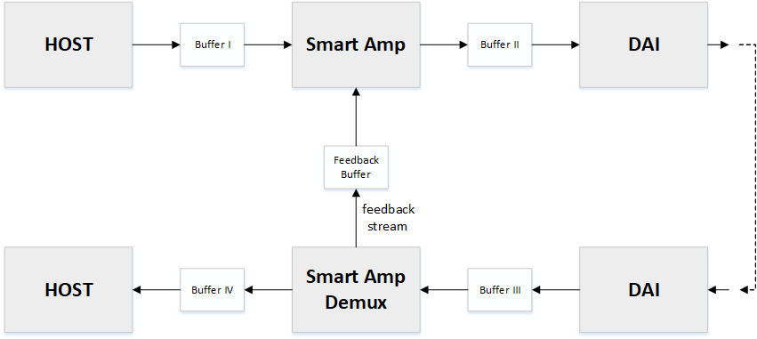
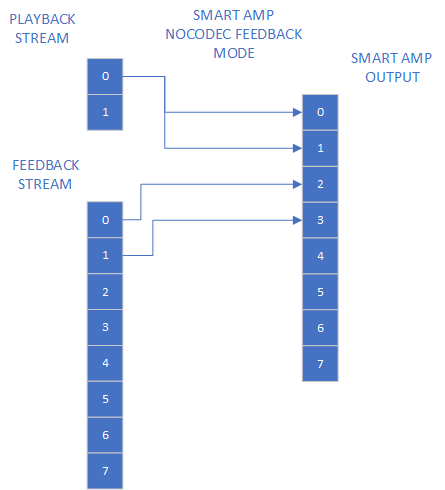

.. _apps-component-smart-amp:

Smart amplifier component integration
#####################################

Before reading Smart amplifier component integration tutorial it is advisable to
become familiar with :doc:`../component-tutorial/tut-intro` tutorial first, 
which takes a step-by-step approach to creating new audio component.

Sound Open Firmware architecture supports creating Smart Amplifier component by
implementing  Smart Amplifier component template (for simplicity, later in
tutorial, Smart Amplifier will be donoted as SA). SA template could be useful in
creating fully functional SA component. What template does is handling basic
pipeline/capture stream and implements dummy functions for processing data. It
is placed in: *<fw_repo_root>/src/samples/audio/smart_amp_test.c* and includes header
from: *<fw_repo_root>/src/include/sof/samples/audio/smart_amp.h*. SA template component
uses standard SOF component API, which is presented in mentioned
:doc:`../component-tutorial/tut-intro` tutorial in more accurate way. The main
difference between SA and other components is the processing functions.

Smart Amplifier topology
************************

SA topology (*sof-smart-amplifier.m4* and *sof-smart-amplifier-nocodec.m4*)
includes playback pipeline with SA component and capture pipeline with demux
component splitting captured stream to host and SA. Stream format and parameters
depicted in the diagram below.

Smart Amplifier private data
****************************

SA template private data is defined at the beginning of
*<fw_repo_root>/src/samples/audio/smart_amp_test.c* file.

.. code-block:: c

	struct smart_amp_data {
		struct sof_smart_amp_config config;
		struct comp_model_data model;

		struct comp_buffer *source_buf; /**< stream source buffer */
		struct comp_buffer *feedback_buf; /**< feedback source buffer */
		struct comp_buffer *sink_buf; /**< sink buffer */

		smart_amp_proc process;

		uint32_t in_channels;
		uint32_t out_channels;
	};

It contains SA config and model data, pointers to source/feedback/sink buffer
(*source_buf*, *feedback_buf*, *sink_buf*), pointer to process function and
number of in/out channels (*in_channels*, *out_channels*). Most of then are
initialized in ``smart_amp_prepare()`` function:

.. code-block:: c

	/* searching for stream and feedback source buffers */
	list_for_item(blist, &dev->bsource_list) {
		source_buffer = container_of(blist, struct comp_buffer,
					     sink_list);

		if (source_buffer->source->comp.type == SOF_COMP_DEMUX)
			sad->feedback_buf = source_buffer;
		else
			sad->source_buf = source_buffer;
	}

	sad->sink_buf = list_first_item(&dev->bsink_list, struct comp_buffer,
					source_list);

	sad->in_channels = sad->source_buf->stream.channels;
	sad->out_channels = sad->sink_buf->stream.channels;

	sad->feedback_buf->stream.channels = sad->config.feedback_channels;

	/* TODO:
	 * ATM feedback buffer frame_fmt is hardcoded to s32_le. It should be
	 * removed when parameters negotiation between pipelines will prepared
	 */
	sad->feedback_buf->stream.frame_fmt = SOF_IPC_FRAME_S32_LE;

	sad->process = get_smart_amp_process(dev);
	if (!sad->process) {
		comp_err(dev, "smart_amp_prepare(): get_smart_amp_process failed");
		return -EINVAL;
	}

SA private data can be redefined to store additional run-time parameters of the
instance. You can also allocate any other data inside SA component (e.g. inside
SA private data). More about memory management you can find at:
:doc:`../mem-mgmt`
In case of allocating large data blocks, the allocation may fail due to
insufficient memory in specific memory zone. In that case you can try to
redefine memory structure for specific zone. E.g. in case of insufficient
memory for ``SOF_MEM_ZONE_RUNTIME`` you can try to add new memory block.
Below example shows how to add 8192 memory block in ``SOF_MEM_ZONE_RUNTIME``
for tigerlake platform.

.. code-block:: diff

	diff --git a/src/platform/intel/cavs/lib/memory.c b/src/platform/intel/cavs/lib/memory.c
	index e5b5677a..94d536ce 100644
	--- a/src/platform/intel/cavs/lib/memory.c
	+++ b/src/platform/intel/cavs/lib/memory.c
	@@ -78,6 +78,7 @@ static SHARED_DATA struct block_hdr mod_block512[HEAP_RT_COUNT512];
	static SHARED_DATA struct block_hdr mod_block1024[HEAP_RT_COUNT1024];
	static SHARED_DATA struct block_hdr mod_block2048[HEAP_RT_COUNT2048];
	static SHARED_DATA struct block_hdr mod_block4096[HEAP_RT_COUNT4096];
	+static SHARED_DATA struct block_hdr mod_block8192[HEAP_RT_COUNT8192];

	/* Heap memory map for modules */
	static SHARED_DATA struct block_map rt_heap_map[] = {
	@@ -88,6 +89,7 @@ static SHARED_DATA struct block_map rt_heap_map[] = {
		BLOCK_DEF(1024, HEAP_RT_COUNT1024, uncached_block_hdr(mod_block1024)),
		BLOCK_DEF(2048, HEAP_RT_COUNT2048, uncached_block_hdr(mod_block2048)),
		BLOCK_DEF(4096, HEAP_RT_COUNT4096, uncached_block_hdr(mod_block4096)),
	+       BLOCK_DEF(8192, HEAP_RT_COUNT8192, uncached_block_hdr(mod_block8192)),
	};

	/* Heap blocks for buffers */
	diff --git a/src/platform/tigerlake/include/platform/lib/memory.h b/src/platform/tigerlake/include/platform/lib/memory.h
	index d9b9f5d3..8b0dbfaa 100644
	--- a/src/platform/tigerlake/include/platform/lib/memory.h
	+++ b/src/platform/tigerlake/include/platform/lib/memory.h
	@@ -253,13 +253,14 @@
	#define HEAP_RT_COUNT1024              4
	#define HEAP_RT_COUNT2048              1
	#define HEAP_RT_COUNT4096              1
	+#define HEAP_RT_COUNT8192              1

	/* Heap configuration */
	#define HEAP_RUNTIME_SIZE \
		(HEAP_RT_COUNT64 * 64 + HEAP_RT_COUNT128 * 128 + \
		HEAP_RT_COUNT256 * 256 + HEAP_RT_COUNT512 * 512 + \
		HEAP_RT_COUNT1024 * 1024 + HEAP_RT_COUNT2048 * 2048 + \
	-       HEAP_RT_COUNT4096 * 4096)
	+       HEAP_RT_COUNT4096 * 4096 + HEAP_RT_COUNT8192 * 8192)

	#define HEAP_BUFFER_SIZE       0x50000
	#define HEAP_BUFFER_BLOCK_SIZE         0x100

Smart Amplifier Config
**********************
SA template component can be configured via smart amplifier config. SA config
struct definition is placed at: *<fw_repo_root>/src/include/sof/samples/audio/smart_amp.h*. 

.. code-block:: c

	struct sof_smart_amp_config {
		uint32_t size;
		uint32_t feedback_channels;
		int8_t source_ch_map[PLATFORM_MAX_CHANNELS];
		int8_t feedback_ch_map[PLATFORM_MAX_CHANNELS];
	};

``size`` refers to config struct size in bytes, ``feedback_channels`` to number
of channels in feedback stream, ``source_ch_map`` and ``feedback_ch_map`` in
turn refers to source and feedback processing channel maps (they will be
described later in tutorial). Default SA values are sent by driver and placed
in *<fw_repo_root>/tools/topology/sof/audio/pipe-smart-amplifier-playback.m4*
file.

.. code-block:: c
	:emphasize-lines: 4, 7-9

	# initial config params for smart_amp, aligned with struct sof_smart_amp_config
	CONTROLBYTES_PRIV(SMART_AMP_priv,
	`		bytes "0x53,0x4f,0x46,0x00,0x00,0x00,0x00,0x00,'
	`		0x18,0x00,0x00,0x00,0x00,0x00,0x00,0x03,'
	`		0x00,0x00,0x00,0x00,0x00,0x00,0x00,0x00,'
	`		0x00,0x00,0x00,0x00,0x00,0x00,0x00,0x00,'
	`		0x18,0x00,0x00,0x00,0x08,0x00,0x00,0x00,'
	`		0x00,0x01,0xff,0xff,0xff,0xff,0xff,0xff,'
	`		0xff,0xff,0x00,0x01,0xff,0xff,0xff,0xff"'
	)

At the beginning of first highlighted line there is size of parameters data
(``struct smart_amp_config`` - it is equal to 0x18 bytes). Last three highlighted
lines describes values for specific ``smart_amp_config`` field:

* ``size = 0x18`` 
* ``feedback_channels = 0x8``
* ``source_ch_map[] = {0, 1, -1, -1, -1, -1, -1, -1}``
* ``feedbach_ch_map[] = {-1, -1, 0, 1, -1, -1, -1, -1}``

In integration process the config struct and the values could be removed/modified. 

Smart Amplifier Model
*********************

SA component could be configured at runtime with data blob (like algorithm
coefficients etc.). The default  data blob (model data) in topology file is
empty. After pipeline/PCM preparation, in order to configure/update with new
data blob use the sotool named ``sof-ctl`` (it is located at:
*<fw_repo_root>/tools/ctl/*). In order  to build sof tools please follow the
instruction at *<fw_repo_root>/tools/README.md*. More information about sof-ctl
tool are also available at: :doc:`../../tuning/sof-ctl`.

To access the right SA instance the name of numid of SA alsa control needs to be
know. This can be retrieved with following command (in this case
*sof-tgl-max98373-rt5682.m4* was used):

.. code-block:: bash

	amixer controls | grep SMART_AMP
	numid=151,iface=MIXER,name='SMART_AMP1.0 Smart_amp Config'
	numid=152,iface=MIXER,name='SMART_AMP1.0 Smart_amp Model'

In order to set model data sof-ctl tool could be used in following way:

.. code-block:: bash

	sudo ./sof-ctl -Dhw:0 -c name='SMART_AMP1.0 Smart_amp Model' -br -s data_blob.bin

, where *data_blob.bin* is binary configuration file. There is also a possibility
to read back data blob from DSP with command:

.. code-block:: bash

	sudo ./sof-ctl -Dhw:0 -c name='SMART_AMP1.0 Smart_amp Model' -br

.. note::
	``sof-ctl`` could be also used in order to set config data mentioned
	in previous paragraph. Above command should be updated with
	``SMART_AMP1.0 Smart_amp Config`` name and given binary file should be
	aligned with ``struct smart_amp_config``

From the firmware side, SA model data are available in SA private data

.. code-block:: c

	struct comp_model_data model;

``comp_model_data`` structure declaration is as follows
(*<fw_repo_root>/src/include/sof/audio/component.h*):

.. code-block:: c

	/** \brief Struct for large component configs */
	struct comp_model_data {
		uint32_t data_size;	/**< size of component's model data */
		void *data;		/**< pointer to model data */
		uint32_t crc;		/**< crc value of model data */
		uint32_t data_pos;	/**< indicates a data position in data
							  *  sending/receiving process
							  */
	};

``data`` is a pointer to received binary data. In integration process
it can be used freely (e.g. casted to any other structure etc.).

Smart Amplifier channels maps
*****************************

SA template component for debugging and verifying purposes can be configured, as
it was metioned in previous paragraph, with different source and feedback channel
maps. Each channel map specifies which channel from input (buffer between host
and SA - ``source_ch_map[]`` or feedback buffer between SA and demux -
``feedback ch_map[])`` will be copied to specific smart amp output channel.
Value "-1" means that for this output channel we will not take any channel from
specific input. In
*<fw_repo_root>/tools/topology/sof/audio/pipe-smart-amplifier-playback.m4* file
there are default values for source and feedback channel maps i.e.
``source_ch_map[] = {0, 1, -1, -1, -1, -1, -1, -1}`` and 
``feedbach_ch_map[] = {-1, -1, 0, 1, -1, -1, -1, -1}`` Below is depicted diagram
illustrating how above channel map works:

.. note:: Channels maps are using only for debugging and verifying SA template component. It can be removed in true integration process.

Smart Amplifier signal processing function ``smart_amp_copy()``
***************************************************************

.. code-block:: c
	:emphasize-lines: 47-49, 66-67

	static int smart_amp_copy(struct comp_dev *dev)
	{
		struct smart_amp_data *sad = comp_get_drvdata(dev);
		uint32_t avail_passthrough_frames;
		uint32_t avail_feedback_frames;
		uint32_t avail_frames;
		uint32_t source_bytes;
		uint32_t sink_bytes;
		uint32_t feedback_bytes;
		uint32_t source_flags = 0;
		uint32_t sink_flags = 0;
		uint32_t feedback_flags = 0;
		int ret = 0;

		comp_dbg(dev, "smart_amp_copy()");

		buffer_lock(sad->source_buf, &source_flags);
		buffer_lock(sad->sink_buf, &sink_flags);

		/* available bytes and samples calculation */
		avail_passthrough_frames =
			audio_stream_avail_frames(&sad->source_buf->stream,
						&sad->sink_buf->stream);

		buffer_unlock(sad->source_buf, source_flags);
		buffer_unlock(sad->sink_buf, sink_flags);

		avail_frames = avail_passthrough_frames;

		buffer_lock(sad->feedback_buf, &feedback_flags);
		if (sad->feedback_buf->source->state == dev->state) {
			/* feedback */
			avail_feedback_frames = sad->feedback_buf->stream.avail /
				audio_stream_frame_bytes(&sad->feedback_buf->stream);

			avail_frames = MIN(avail_passthrough_frames,
					avail_feedback_frames);

			feedback_bytes = avail_frames *
				audio_stream_frame_bytes(&sad->feedback_buf->stream);

			buffer_unlock(sad->feedback_buf, feedback_flags);

			comp_dbg(dev, "smart_amp_copy(): processing %d feedback frames (avail_passthrough_frames: %d)",
				avail_frames, avail_passthrough_frames);

			sad->process(dev, &sad->feedback_buf->stream,
					&sad->sink_buf->stream, avail_frames,
					sad->config.feedback_ch_map);

			comp_update_buffer_consume(sad->feedback_buf, feedback_bytes);
		}

		/* bytes calculation */
		buffer_lock(sad->source_buf, &source_flags);
		source_bytes = avail_frames *
			audio_stream_frame_bytes(&sad->source_buf->stream);
		buffer_unlock(sad->source_buf, source_flags);

		buffer_lock(sad->sink_buf, &sink_flags);
		sink_bytes = avail_frames *
			audio_stream_frame_bytes(&sad->sink_buf->stream);
		buffer_unlock(sad->sink_buf, sink_flags);

		/* process data */
		sad->process(dev, &sad->source_buf->stream, &sad->sink_buf->stream,
				avail_frames, sad->config.source_ch_map);

		/* source/sink buffer pointers update */
		comp_update_buffer_consume(sad->source_buf, source_bytes);
		comp_update_buffer_produce(sad->sink_buf, sink_bytes);

		return ret;
	}

The main task of SA template component is to process playback and feedback
stream provided by demux component. SA template implements ``smart_amp_copy()``
function, which is invoked in ``pipeline_copy()`` (``pipeline_copy()`` calls
copying on every component in pipeline) during every pipeline period after
trigger start command. Firstly, in ``smart_amp_copy()`` function, there is a
invocation of generic ``audio_stream_avail_frames()`` in order to calculate,
how many frames we can copy from source to sink buffer.

.. code-block:: c

	/* available bytes and samples calculation */
	avail_passthrough_frames = audio_stream_avail_frames(&sad->source_buf->stream, &sad->sink_buf->stream);

Next, if feedback stream is active, we calculate how mamy frames are available
in feedback buffer, and then we compute minimal passthrough and feedback frames
values.

.. code-block:: c

	avail_feedback_frames = sad->feedback_buf->stream.avail / audio_stream_frame_bytes(&sad->feedback_buf->stream);
	avail_frames = MIN(avail_passthrough_frames, avail_feedback_frames);

There is also calculation of available bytes, which are copied from
source/feedback buffers and corresponding number of butes the copied data chunk
occupies in sink buffer. Since source, feedback and sink buffers formats can be
different (e.g. different number of channels) source, sink and feedback bytes do
not have to be equal. Numbers of bytes are calculated using generic
``audio_stream_frame_bytes()`` function (it computes how much memory a single
frame occupies for a given stream).

.. code-block:: c

	feedback_bytes = avail_frames * audio_stream_frame_bytes(&sad->feedback_buf->stream);
	source_bytes = avail_frames * audio_stream_frame_bytes(&sad->source_buf->stream);
	sink_bytes = avail_frames * audio_stream_frame_bytes(&sad->sink_buf->stream);

Processing and copying data takes place in ``smart_amp_process_s16()`` and 
``smart_amp_process_s32()`` functions (please refer to highlighted lines in
``smart_amp_copy()`` ), which were earlier (in ``smart_amp_prepare()``)
assigned to  ``sad->process`` pointer using the ``get_smart_amp_process()``:

.. code-block:: c

	sad->process = get_smart_amp_process(dev);
	if (!sad->process) {
		comp_err(dev, "smart_amp_prepare(): get_smart_amp_process failed");
		return -EINVAL;
	}

``get_smart_amp_process()`` selects proper funtion based on source data format.

.. code-block:: c

	static smart_amp_proc get_smart_amp_process(struct comp_dev *dev)
	{
		struct smart_amp_data *sad = comp_get_drvdata(dev);

		switch (sad->source_buf->stream.frame_fmt) {
		case SOF_IPC_FRAME_S16_LE:
			return smart_amp_process_s16;
		case SOF_IPC_FRAME_S24_4LE:
		case SOF_IPC_FRAME_S32_LE:
			return smart_amp_process_s32;
		default:
			comp_err(dev, "smart_amp_process() error: not supported frame format");
			return NULL;
		}
	}

``smart_amp_process_s16()`` and ``smart_amp_process_s32()`` functions require
available frames , pointers to source and sink buffers and channel map pointer
(note: channel map is only for testing template component). They just copy
available frames from given source to sink buffers according to given channel
map. In integration process those functions should be changed base on specific
processing algorithm. In order to read/write from/to the circular buffers you
can use following audio stream functions placed in
*<fw_repo_root>/src/include/sof/audio/audio_stream.h*

.. code-block:: c

	audio_stream_read_frag_s32()
	audio_stream_write_frag_s32()
	audio_stream_read_frag_s16()
	audio_stream_write_frag_s16()

Usage of above functions are presented in mentioned ``smart_amp_process_s32()`` function.

.. code-block:: c

	static int smart_amp_process_s32(struct comp_dev *dev,
						const struct audio_stream *source,
						const struct audio_stream *sink,
						uint32_t frames, int *chan_map)
		{
			struct smart_amp_data *sad = comp_get_drvdata(dev);
			int32_t *src;
			int32_t *dest;
			uint32_t in_buff_frag = 0;
			uint32_t out_buff_frag = 0;
			int i;
			int j;

			comp_info(dev, "smart_amp_process_s32()");

			for (i = 0; i < frames; i++) {
				for (j = 0 ; j < sad->out_channels; j++) {
					if (chan_map[j] != -1) {
						src = audio_stream_read_frag_s32(source, in_buff_frag + chan_map[j]);	
						dest = audio_stream_write_frag_s32(sink, out_buff_frag);
						*dest = *src;
					}
					out_buff_frag++;
				}
				in_buff_frag += source->channels;
			}

			return 0;
		}

After all we should update buffers read and write pointers using
``comp_update_buffer_consume()`` (updates read pointer) and
``comp_update_buffer_produce()`` (updates write pointer).

.. code-block:: c

	comp_update_buffer_consume(sad->source_buf, source_bytes);
	comp_update_buffer_produce(sad->sink_buf, sink_bytes);
	comp_update_buffer_consume(sad->feedback_buf, feedback_bytes);

Summarize
*********

* In order to initialize your processing variables/functions you can add
  specific variables to ``smart_amp_data`` private struct and and initialize
  the by modifying ``smart_amp_new()`` / ``smart_amp_prepare()`` functions.
* In order to configure SA component you can use and modify SA config and
  model data
* In order to use your own processing functions you should invoke them
  by modifying ``smart_amp_copy()`` and ``smart_amp_process()`` functions.

