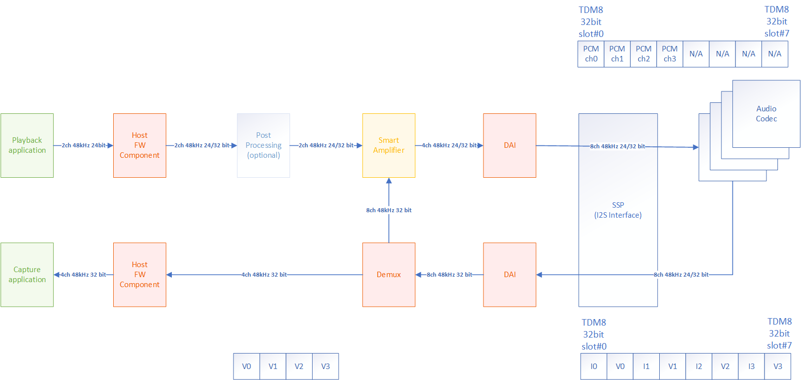

.. _apps-component-smart-amp:

Smart amplifier component
#########################

Sound Open Firmware architecture supports smart amplifier
components. Basic smart amplifier template is available at
the following link:
https://github.com/thesofproject/sof/tree/topic/smart-amp-comp .
Before reading the following tutorial, it is advisable to become familiar
with :ref:`developer_guides_hello_world`.

Above template could be useful to implement fully functional Smart Amp and
Smart Amp Demux component. What above template does is handling basic pipeline/capture
stream and implements dummy functions for processing feedback stream.
Smart Amp and Smart Amp Demux functions are placed in the same file: *src/audio/dsm.c*
and they are split into two separate ``comp_driver`` structures.

.. code-block:: c

	struct comp_driver comp_smart_amp = {
		.type = SOF_COMP_SMART_AMP,
		.ops = {
			.new = smart_amp_new,
			.free = smart_amp_free,
			.params = smart_amp_params,
			.prepare = smart_amp_prepare,
			.trigger = smart_amp_trigger,
			.copy = smart_amp_copy,
			.reset = smart_amp_reset,
		},
	};

	struct comp_driver comp_smart_amp_demux = {
		.type = SOF_COMP_SMART_AMP_DEMUX,
		.ops = {
			.new = smart_amp_new,
			.free = smart_amp_free,
			.params = smart_amp_params,
			.prepare = smart_amp_demux_prepare,
			.trigger = smart_amp_demux_trigger,
			.copy = smart_amp_demux_copy,
			.reset = smart_amp_reset,
		},
	};
 
Some of teamplate functions e.g. smart_amp_new() are the same for Smart Amp and 
Smart Amp Demux component.

Basic Smart Amp Topology
************************

Basic Smart Amp topology consists of two components: Smart Amp component
included in the playback pipeline and Smart Amp Demux component included in
the capture pipeline. Also, there is required,  additional buffer
between Smart Amp and Smart Amp Demux components for the "feedback" stream.

        

Constructor ``smart_amp_new()``
*******************************

.. code-block:: c

	static struct comp_dev *smart_amp_new(struct sof_ipc_comp *comp)
	{
		struct comp_dev *dev;
		struct sof_ipc_comp_smart_amp *sa;
		struct sof_ipc_comp_smart_amp *ipc_sa =
			(struct sof_ipc_comp_smart_amp *)comp;
		struct smart_amp_data *sad;

		trace_smart_amp("smart_amp_new()");

		if (IPC_IS_SIZE_INVALID(ipc_sa->config)) {
			IPC_SIZE_ERROR_TRACE(TRACE_CLASS_SMART_AMP, ipc_sa->config);
			return NULL;
		}

		dev = rzalloc(RZONE_RUNTIME, SOF_MEM_CAPS_RAM,
				  COMP_SIZE(struct sof_ipc_comp_smart_amp));
		if (!dev)
			return NULL;

		sa = (struct sof_ipc_comp_smart_amp *)&dev->comp;

		assert(!memcpy_s(sa, sizeof(*sa), ipc_sa,
			   sizeof(struct sof_ipc_comp_smart_amp)));

		sad = rzalloc(RZONE_RUNTIME, SOF_MEM_CAPS_RAM, sizeof(*sad));

		if (!sad) {
			rfree(dev);
			return NULL;
		}

		comp_set_drvdata(dev, sad);
		dev->state = COMP_STATE_READY;

		return dev;
	}

Above ``smart_amp_new()`` constructor is the same for Smart Amp and Smart Amp Demux component.
The constructor:

* Allocates memory for a device common context based on the specific
  ``struct sof_ipc_comp_smart_amp`` 
  
* Allocates memory for the smart amplifier component private data. Private data could
  be fetched by calling ``comp_set_drvdata()`` macro.
  
  .. code-block:: c

		struct smart_amp_data {
			struct comp_buffer *source_buf; /**< stream source buffer */
			struct comp_buffer *feedback_buf; /**< feedback source buffer */
			struct comp_buffer *sink_buf; /**< sink buffer */
		};
  
  In template, ``smart_amp_data`` contains pointers to source, sink and feedback
  buffers (respectively, given the above topology scheme, for Smart Amp component
  source is Buffer I, sink is Buffer II, and for Smart Amp Demux component
  source is Buffer III, sink is Buffer IV). Any needed variable can be added
  to this structure.

* Sets Smart Amp/Smart Amp Demux component state to ``COMP_STATE_READY``

Destructor ``smart_amp_free()``
*******************************

Destructor frees memory allocated in smart amp constructor: smart amp private data and
device common context. Template Smart Amp and Smart Amp Demux components has the same
destructor.

.. code-block:: c

	static void smart_amp_free(struct comp_dev *dev)
	{
		struct smart_amp_data *sad = comp_get_drvdata(dev);

		trace_smart_amp("smart_amp_free()");

		rfree(sad);
		rfree(dev);
	}

Smart Amp state transition handler ``smart_amp_trigger()``
**********************************************************

Smart Amp component transition handler invokes the ``comp_set_state()``
function and zeros the feedback buffer in case of ``COMP_TRIGGER_START``
or ``COMP_TRIGGER_RELEASE`` command in order to remove outdated data.

.. code-block:: c
	:emphasize-lines: 8, 14-17

	static int smart_amp_trigger(struct comp_dev *dev, int cmd)
	{
		struct smart_amp_data *sad = comp_get_drvdata(dev);
		int ret = 0;

		trace_smart_amp("smart_amp_trigger(), command = %u", cmd);

		ret = comp_set_state(dev, cmd);

		if (ret == COMP_STATUS_STATE_ALREADY_SET)
			ret = PPL_STATUS_PATH_STOP;

		switch (cmd) {
		case COMP_TRIGGER_START:
		case COMP_TRIGGER_RELEASE:
			buffer_zero(sad->feedback_buf);
			break;
		case COMP_TRIGGER_PAUSE:
		case COMP_TRIGGER_STOP:
			break;
		default:
			break;
		}

		return ret;
	}

Smart Amp Demux state transition handler ``smart_amp_demux_trigger()``
**********************************************************************

Smart Amp Demux component transition handler just invokes ``comp_set_state()``.

.. code-block:: c
	:emphasize-lines: 7
	
	static int smart_amp_demux_trigger(struct comp_dev *dev, int cmd)
	{
		int ret = 0;

		trace_smart_amp("smart_amp_demux_trigger(), command = %u", cmd);

		ret = comp_set_state(dev, cmd);

		if (ret == COMP_STATUS_STATE_ALREADY_SET)
			ret = PPL_STATUS_PATH_STOP;

		return ret;
	}

Smart Amp stream parameters handler ``smart_amp_prepare()``
***********************************************************

``smart_amp_prepare()`` function is a place, where Smart Amp component
can be reconfigured for the stream parameters.

Smart Amp component has two source buffers and one sink buffer. There is
necessity to identify which of the source buffers is the feedback buffer 
(identification is based on ``feedback_buf_id`` in ``struct sof_ipc_comp_smart_amp``
- see highlighted lines).

There is also ``period_bytes`` calculation based on number of frames and
bytes per frame fetched from ``comp_frame_bytes()`` function.

.. code-block:: c
	:emphasize-lines: 40-49
	
	static int smart_amp_prepare(struct comp_dev *dev)
	{
		struct sof_ipc_comp_config *config = COMP_GET_CONFIG(dev);
		struct sof_ipc_comp_smart_amp *ipc_sa =
			(struct sof_ipc_comp_smart_amp *)&dev->comp;
		struct smart_amp_data *sad = comp_get_drvdata(dev);
		struct comp_buffer *source_buffer;
		struct list_item *blist;
		uint32_t period_bytes;
		int ret;

		(void)ipc_sa;

		trace_smart_amp("smart_amp_prepare()");

		ret = comp_set_state(dev, COMP_TRIGGER_PREPARE);
		if (ret < 0)
			return ret;

		if (ret == COMP_STATUS_STATE_ALREADY_SET)
			return PPL_STATUS_PATH_STOP;

		/* calculate period size based on config */
		period_bytes = dev->frames * comp_frame_bytes(dev);
		if (period_bytes == 0) {
			trace_smart_amp_error("smart_amp_prepare() error: "
						  "period_bytes = 0");
			return -EINVAL;
		}

		/* set downstream buffer size */
		ret = comp_set_sink_buffer(dev, period_bytes, config->periods_sink);
		if (ret < 0) {
			trace_smart_amp_error("smart_amp_prepare() error: "
						  "comp_set_sink_buffer() failed");
			return ret;
		}

		/* searching for stream and feedback source buffers */
		list_for_item(blist, &dev->bsource_list) {
			source_buffer = container_of(blist, struct comp_buffer,
							 sink_list);

			if (source_buffer->ipc_buffer.comp.id ==
				ipc_sa->feedback_buf_id)
				sad->feedback_buf = source_buffer;
			else
				sad->source_buf = source_buffer;
		}

		sad->sink_buf = list_first_item(&dev->bsink_list, struct comp_buffer,
						source_list);

		return 0;
	}

Smart Amp Demux stream parameters handler ``smart_amp_demux_prepare()``
***********************************************************************

In contrast to Smart Amp, Smart Amp Demux has two sink buffers and one
source buffer. Identification of feedback buffer is made in similar way
as in Smart Amp (see highlighted lines).

.. code-block:: c
	:emphasize-lines: 30-40
	
	static int smart_amp_demux_prepare(struct comp_dev *dev)
	{
		struct sof_ipc_comp_smart_amp *ipc_sa =
			(struct sof_ipc_comp_smart_amp *)&dev->comp;
		struct smart_amp_data *sad = comp_get_drvdata(dev);
		struct comp_buffer *sink_buffer;
		struct list_item *blist;
		uint32_t period_bytes;
		int ret;

		(void)ipc_sa;

		trace_smart_amp("smart_amp_demux_prepare()");

		ret = comp_set_state(dev, COMP_TRIGGER_PREPARE);
		if (ret < 0)
			return ret;

		if (ret == COMP_STATUS_STATE_ALREADY_SET)
			return PPL_STATUS_PATH_STOP;

		/* calculate period size based on config */
		period_bytes = dev->frames * comp_frame_bytes(dev);
		if (period_bytes == 0) {
			trace_smart_amp_error("smart_amp_prepare() error: "
						  "period_bytes = 0");
			return -EINVAL;
		}

		/* searching for stream and feedback source buffers */
		list_for_item(blist, &dev->bsink_list) {
			sink_buffer = container_of(blist, struct comp_buffer,
						   source_list);

			if (sink_buffer->ipc_buffer.comp.id ==
				ipc_sa->feedback_buf_id)
				sad->feedback_buf = sink_buffer;
			else
				sad->sink_buf = sink_buffer;
		}

	sad->source_buf = list_first_item(&dev->bsource_list,
					  struct comp_buffer, sink_list);

	return 0;
	}

Smart Amp signal processing function ``smart_amp_copy()``
*********************************************************

The main task of Smart Amp component is to process playback stream and feedback
stream provided by Smart Amp Demux. Smart Amp template component has implemented
``smart_amp_copy()`` function, which just copies playback stream and ivokes
dummy ``smart_amp_process_feedback_data()`` function to process "feedback"
data.

.. code-block:: c

	static int smart_amp_copy(struct comp_dev *dev)
	{
		struct smart_amp_data *sad = comp_get_drvdata(dev);
		uint32_t avail_frames;
		uint32_t copy_bytes;
		uint32_t copy_samples;
		int ret = 0;

		trace_smart_amp_with_ids(dev, "smart_amp_copy()");

		/* available bytes and samples calculation */
		avail_frames = comp_avail_frames(sad->source_buf, sad->sink_buf);
		copy_bytes = avail_frames * comp_frame_bytes(dev);
		copy_samples = copy_bytes / comp_sample_bytes(dev);

		/* process data */
		smart_amp_process(dev, copy_samples, sad->source_buf, sad->sink_buf);

		/* sink and source buffer pointers update */
		comp_update_buffer_produce(sad->sink_buf, copy_bytes);
		comp_update_buffer_consume(sad->source_buf, copy_bytes);

		/* from feedback buffer we should consume as much data as we consume
		 * from source buffer.
		 */
		if (sad->feedback_buf->avail < copy_bytes) {
			trace_smart_amp_with_ids(dev, "smart_amp_copy(): not enough "
						 "data in feedback buffer");

			return ret;
		}

		trace_smart_amp_with_ids(dev, "smart_amp_copy(): processing %d "
					 "feedback bytes", copy_bytes);
		smart_amp_process_feedback_data(sad->feedback_buf, copy_samples);
		comp_update_buffer_consume(sad->feedback_buf, copy_bytes);

		return ret;
	}

Above ``smart_amp_copy()`` function is invoked in ``pipeline_copy()`` during
every system tick after trigger start. In implemented ``smart_amp_copy()`` 
function there is available bytes and samples calculation based on
source and sink buffers. ``smart_amp_process()`` copies available samples
from source to sink buffer. ``comp_updated_buffer_produce()`` and
``comp_update_buffer_consume()`` are used for update buffers read and
write pointers. At the end of ``smart_amp_copy()``, there is dummy 
``smart_amp_process_feedback_data()`` function incovation, which can be used
as a template for feedback data processing algorithm implementation.

.. code-block:: c

	static int smart_amp_process_feedback_data(struct comp_buffer *buf, uint32_t samples)
	{
		(void)buf;
		(void)samples;

		/* here it is possible to process samples from feedback buf */

		return 0;
	}

In order to implement your own dedicated processing algorithm, you need
to modify ``smart_amp_copy()`` and ``smart_amp_process_feedback_data()`` functions.
All necessary additional private variables could be declared in
``smart_amp_data`` struct.

Smart Amp Demux signal processing function ``smart_amp_demux_copy()``
*********************************************************************

The main task of Smart Amp Demux component is to process stream from
digital audio interface (DAI) and split it into "feedback" and capture
stream. Smart Amp Demux template component has implemented ``smart_amp_demux_copy()``
function, which copies available data from source buffer to sink and 
feedback buffers.

.. code-block:: c

	static int smart_amp_demux_copy(struct comp_dev *dev)
	{
		struct smart_amp_data *sad = comp_get_drvdata(dev);
		uint32_t avail_frames;
		uint32_t copy_bytes;
		uint32_t copy_samples;
		int ret = 0;

		trace_smart_amp_with_ids(dev, "smart_amp_demux_copy()");

		avail_frames = comp_avail_frames(sad->source_buf, sad->sink_buf);
		copy_bytes = avail_frames * comp_frame_bytes(dev);
		copy_samples = copy_bytes / comp_sample_bytes(dev);

		trace_smart_amp_with_ids(dev, "smart_amp_demux_copy(): copy from "
					 "source_buf to sink_buf");
		smart_amp_process(dev, copy_samples, sad->source_buf, sad->sink_buf);

		trace_smart_amp_with_ids(dev, "smart_amp_demux_copy(): copy from "
					 "source_buf to feedback_buf");
		smart_amp_process(dev, copy_samples, sad->source_buf,
				  sad->feedback_buf);

		/* update buffer pointers */
		comp_update_buffer_produce(sad->sink_buf, copy_bytes);
		comp_update_buffer_produce(sad->feedback_buf, copy_bytes);
		comp_update_buffer_consume(sad->source_buf, copy_bytes);

		return ret;
	}

Above ``smart_amp_demux_copy()`` function, the same as ``smart_amp_copy()``, is invoked
in ``pipeline_copy()`` during every system tick after trigger start. At the
beginning, there is available bytes and samples calculation. This is
followed by copying avaiable data from source to sink and feedback buffers,
using generic ``smart_amp_process()`` function. In order to implement your own
dedicated demux algorithm, you need to modify ``smart_amp_demux_copy()``
function.
